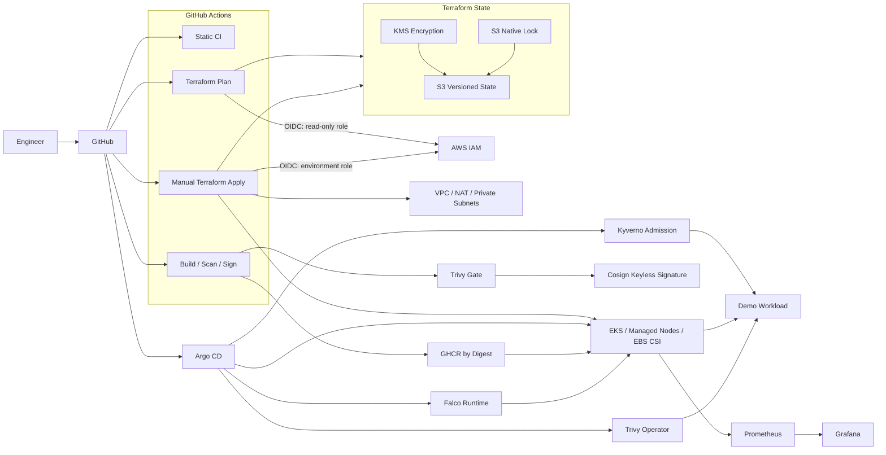

# Platform Engineering — AWS EKS GitOps

[](https://github.com/fadyy2k/platform-engineering-eks-gitops/actions/workflows/terraform.yml)
[](https://github.com/fadyy2k/platform-engineering-eks-gitops/actions/workflows/kubernetes.yml)
[](https://github.com/fadyy2k/platform-engineering-eks-gitops/actions/workflows/security.yml)
[](https://github.com/fadyy2k/platform-engineering-eks-gitops/actions/workflows/image.yml)
[](https://github.com/fadyy2k/platform-engineering-eks-gitops/actions/workflows/policy.yml)

A platform-engineering reference implementation for **AWS EKS, Terraform, GitHub OIDC, GitOps, supply-chain security, admission policy, runtime detection, and observability**.

The project is deliberately organized as a reusable engineering pattern rather than a course deliverable. It separates bootstrap identity/state, environment-specific infrastructure, application delivery, GitOps, and observability so each trust boundary can be reviewed independently.

> **Cost / activation note:** the repository contains the infrastructure and identity code, but it does not automatically create AWS resources. Running the bootstrap or EKS apply workflows can create billable AWS resources and should happen only after reviewing the Terraform plan and account controls.

## Architecture



## Trust Boundaries

- **No long-lived AWS keys in GitHub** — plan/apply credentials are short-lived STS sessions issued through GitHub Actions OIDC.
- **Plan and apply are different roles** — plans are read-only against AWS resources; applies receive an enumerated platform mutation policy.
- **Fork PRs never receive the AWS plan role** — untrusted forks still get static validation without cloud credentials.
- **Apply is environment-scoped** — `dev`, `staging`, and `prod` use GitHub Environment OIDC subjects and separate Terraform state keys.
- **State is treated as sensitive** — S3 public access is blocked, versioning is enabled, KMS encryption is configured, and native S3 locking is used.
- **Images are promoted by digest** — the project-owned demo image is scanned, attested, and keylessly signed with Cosign before it is considered promotable.
- **Admission verifies provenance, not just syntax** — Kyverno denies mutable/unapproved images and verifies the Cosign keyless identity before pods are admitted.
- **Runtime controls are independent of CI** — Pod Security Admission, NetworkPolicy, Trivy Operator, and Falco continue enforcing/observing after deployment.

## Repository Layout

```text
.
├── bootstrap/                     # State bucket, KMS, GitHub OIDC + plan/apply roles
├── infra/                         # Terraform VPC + EKS root module
│   └── environments/              # dev / staging / prod variables + backend examples
├── demo-app/                      # Minimal project-owned Go workload + Dockerfile
├── apps/demo/                     # Hardened Kubernetes workload manifests
├── platform/argocd/               # Argo CD desired-state definition
├── platform/storage/              # Encrypted gp3 StorageClass
├── observability/                 # kube-prometheus-stack values
├── security/                      # Kyverno, Trivy Operator and Falco policy/config
├── scripts/                       # Backend/GitHub configuration helpers
├── docs/                          # IAM, state recovery, promotion, supply-chain docs
└── .github/workflows/             # Validation, plan, apply, image, security workflows
```

## Phase 2: Identity and Delivery

The repository now implements the code path for:

- GitHub Actions → AWS OIDC federation
- separate Terraform plan/apply roles
- KMS-encrypted, versioned remote state with S3 native locking
- independent `dev`, `staging`, and `prod` state/configuration
- manual, protected-environment Terraform applies
- project-owned container build
- BuildKit provenance + SBOM attestations
- Trivy image gate
- Cosign keyless signing with GitHub OIDC

AWS-side activation still requires an explicitly reviewed `terraform apply` of `bootstrap/`. See [Bootstrap](docs/BOOTSTRAP.md).


## Phase 3: Policy and Runtime Security

Phase 3 moves the project beyond pre-deployment scanning and adds controls inside the Kubernetes trust boundary:

- Kubernetes **restricted Pod Security Admission** for `platform-demo`
- default-deny ingress/egress **NetworkPolicy** with explicit DNS and application traffic
- Kyverno **ValidatingPolicy** requiring the project-owned image by SHA-256 digest
- Kyverno **ImageValidatingPolicy** verifying the Cosign keyless signature from `image.yml`
- Trivy Operator for recurring vulnerability, SBOM, configuration, RBAC, infrastructure and compliance reports
- Falco runtime detection with the modern eBPF driver and least-privileged chart mode
- dedicated policy CI that executes Kyverno positive/negative tests and renders every pinned security Helm chart

The signed image policy is tested against the real GHCR digest created in Phase 2. See [Runtime Security](docs/RUNTIME_SECURITY.md).

## Quick Start — Local Validation Only

These commands do **not** create AWS resources:

```bash
make fmt
make validate
make k8s-check
make demo-test
```

## Activate Remote State + OIDC

Use a short-lived, approved AWS bootstrap session and review every plan:

```bash
cp bootstrap/terraform.tfvars.example bootstrap/terraform.tfvars
terraform -chdir=bootstrap init
terraform -chdir=bootstrap plan
terraform -chdir=bootstrap apply

./scripts/render-backend-config.sh dev
./scripts/render-backend-config.sh staging
./scripts/render-backend-config.sh prod
./scripts/configure-github-repo.sh
```

Then local environment plans can use:

```bash
make plan TF_ENV=dev
```

Full sequence: [docs/BOOTSTRAP.md](docs/BOOTSTRAP.md)

## Environment Promotion

```text
PR
 ├─ static Terraform / Kubernetes / security checks
 └─ trusted OIDC plans: dev + staging + prod
        │
        ▼
protected main
 ├─ manual apply → dev
 ├─ validate / soak
 ├─ manual apply → staging
 ├─ validate / soak
 └─ manual apply → prod
```

Details: [docs/ENVIRONMENTS.md](docs/ENVIRONMENTS.md)

## Container Supply Chain

`demo-app/` is intentionally tiny so the delivery controls are easy to inspect. On protected `main` or a version tag, GitHub Actions:

1. runs Go tests and `go vet`
2. builds and publishes to GHCR
3. emits BuildKit provenance and SBOM attestations
4. scans the immutable digest with Trivy
5. signs the digest with Cosign using GitHub OIDC
6. verifies that the signature identity matches this repository's workflow

Details and verification command: [docs/SUPPLY_CHAIN.md](docs/SUPPLY_CHAIN.md)

## Terraform State Recovery

State versioning is useful only if recovery is documented. The recovery notes cover object versions, stale locks, KMS safety, and refresh-only validation:

[docs/STATE_RECOVERY.md](docs/STATE_RECOVERY.md)

## IAM Model

The bootstrap policy intentionally avoids broad AWS managed administrator policies. IAM mutation is scoped to project-prefixed roles/policies, while network/EKS actions are explicitly enumerated.

The remaining production hardening process is evidence-driven: exercise the stack in a non-production account, inspect CloudTrail denials, and add only justified permissions.

[docs/IAM.md](docs/IAM.md)

## GitOps + Observability

After an EKS environment exists:

```bash
kubectl apply -f platform/argocd/platform-demo-application.yaml
```

Argo CD reconciles the application desired state from Git.

Monitoring values are versioned under `observability/`:

```bash
helm upgrade --install monitoring prometheus-community/kube-prometheus-stack \
  --namespace monitoring --create-namespace \
  -f observability/kube-prometheus-stack-values.yaml
```

Grafana credentials are referenced through an existing Kubernetes Secret and are not committed.

## Security Controls Already in the Repository

- protected `main` branch
- CODEOWNERS
- Dependabot
- GitHub secret scanning + push protection
- Gitleaks
- Trivy IaC/config scanning
- Terraform format/validate CI
- Kubernetes schema validation
- non-root workload security context
- dropped Linux capabilities
- RuntimeDefault seccomp
- resource requests/limits
- private-first EKS API default
- encrypted gp3 storage class
- OIDC-based AWS access design
- signed container delivery design
- restricted Pod Security Admission
- default-deny NetworkPolicy
- Kyverno immutable-image and keyless-signature admission policies
- Trivy Operator continuous workload scanning configuration
- Falco modern-eBPF runtime detection configuration
- policy/chart rendering CI

## Deliberate Gaps / Next Phase

Phase 4 focuses on **reliability engineering and operational response**:

- SLOs and recording rules
- actionable alert routing
- autoscaling / Karpenter evaluation
- backup and restore tests
- game-day failure scenarios and runbooks

See [ROADMAP.md](docs/ROADMAP.md).

## License

MIT
