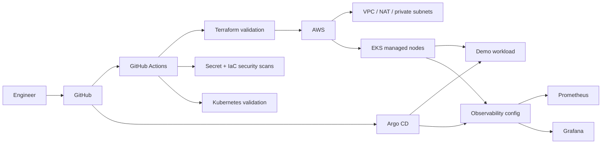

# Platform Engineering — EKS GitOps Lab

[](https://github.com/fadyy2k/platform-engineering-eks-gitops/actions/workflows/terraform.yml)
[](https://github.com/fadyy2k/platform-engineering-eks-gitops/actions/workflows/kubernetes.yml)
[](https://github.com/fadyy2k/platform-engineering-eks-gitops/actions/workflows/security.yml)

A clean platform-engineering reference project that provisions **AWS EKS with Terraform**, bootstraps **Argo CD GitOps**, validates Kubernetes manifests in CI, and defines an observability baseline with **Prometheus + Grafana**.

This repository is intentionally separate from my DEPI projects: it is organized as a reusable platform pattern rather than a course deliverable.

## Architecture



## Engineering Goals

- **Private-first cluster networking** — worker nodes live in private subnets; public cluster API access is disabled by default.
- **GitOps over click-ops** — application desired state lives in Git and Argo CD reconciles it.
- **No committed secrets** — example configuration uses placeholders; runtime secrets are created out-of-band.
- **Policy before apply** — Terraform formatting/validation, Kubernetes schema validation, secret scanning, and IaC scanning run before infrastructure changes.
- **Observable by design** — Prometheus/Grafana values are versioned with the platform configuration.
- **Safe automation** — CI validates by default; infrastructure apply is intentionally not auto-approved from pull requests.

## Repository Layout

```text
.
├── infra/                         # Terraform: VPC + EKS
├── apps/demo/                     # Hardened demo Kubernetes workload
├── platform/argocd/               # Argo CD application definition
├── observability/                 # kube-prometheus-stack values
├── docs/ROADMAP.md                # Build-out plan
└── .github/workflows/             # Terraform, Kubernetes and security gates
```

## Quick Start

### 1. Validate Terraform

```bash
cd infra
cp terraform.tfvars.example terraform.tfvars
terraform init
terraform fmt -check -recursive
terraform validate
terraform plan
```

### 2. Provision EKS

Review the plan, then run apply manually from an authenticated admin workstation:

```bash
terraform apply
aws eks update-kubeconfig --region eu-central-1 --name platform-lab-dev
```

### 3. Bootstrap Argo CD

Install Argo CD using the upstream Helm chart or manifests, then apply:

```bash
kubectl apply -f platform/argocd/platform-demo-application.yaml
```

Argo CD will reconcile the demo workload from `apps/demo`.

### 4. Observability

Install `kube-prometheus-stack` with:

```bash
helm upgrade --install monitoring prometheus-community/kube-prometheus-stack \
  --namespace monitoring --create-namespace \
  -f observability/kube-prometheus-stack-values.yaml
```

Create the Grafana admin secret separately; do not commit the password.

## Security Model

- EKS API endpoint defaults to private access only.
- No `0.0.0.0/0` SSH/admin ingress is defined.
- Workloads use resource limits, non-root execution, dropped Linux capabilities, and RuntimeDefault seccomp where supported.
- Terraform variables and `.env`-style files are ignored.
- Gitleaks/Trivy security checks run in GitHub Actions.
- Dependabot tracks Terraform and GitHub Actions updates.
- Secret scanning and push protection are enabled on the repository.

## What This Project Does Not Pretend To Be

This is a **reference lab**, not an automatically production-ready landing zone. A production implementation would additionally require organizational IAM design, remote encrypted Terraform state with locking, OIDC-based CI cloud authentication, policy-as-code, network egress controls, centralized logging, SLOs/alerting, backup/restore tests, and a documented incident/runbook model.

See [ROADMAP.md](docs/ROADMAP.md) for the planned progression.

## License

MIT
