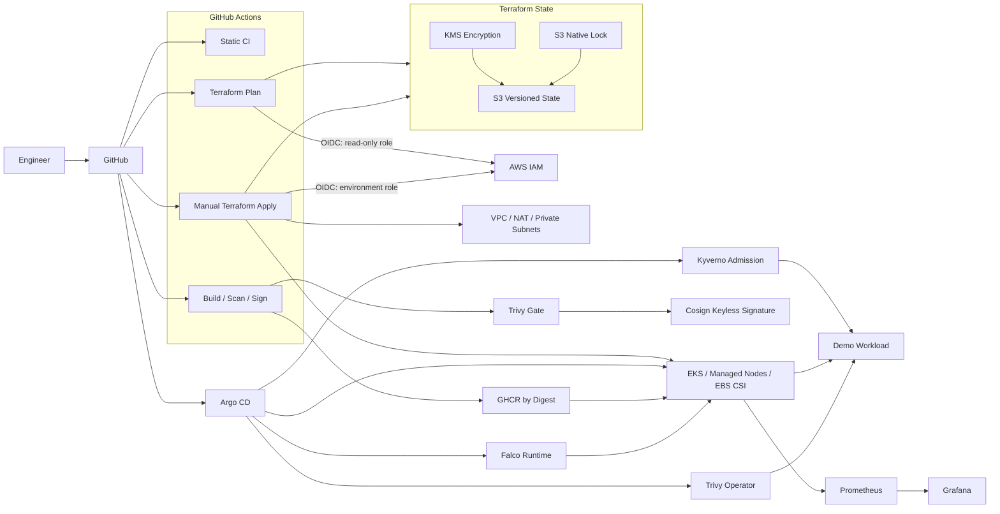

# Platform Engineering — AWS EKS GitOps

[](https://github.com/fadyy2k/platform-engineering-eks-gitops/actions/workflows/terraform.yml)
[](https://github.com/fadyy2k/platform-engineering-eks-gitops/actions/workflows/kubernetes.yml)
[](https://github.com/fadyy2k/platform-engineering-eks-gitops/actions/workflows/security.yml)
[](https://github.com/fadyy2k/platform-engineering-eks-gitops/actions/workflows/image.yml)
[](https://github.com/fadyy2k/platform-engineering-eks-gitops/actions/workflows/policy.yml)
[](https://github.com/fadyy2k/platform-engineering-eks-gitops/actions/workflows/reliability.yml)
[](https://github.com/fadyy2k/platform-engineering-eks-gitops/actions/workflows/operations.yml)
[](https://github.com/fadyy2k/platform-engineering-eks-gitops/actions/workflows/live-readiness.yml)
[](https://github.com/fadyy2k/platform-engineering-eks-gitops/actions/workflows/local-runtime-integration.yml)

A platform-engineering reference implementation for **AWS EKS, Terraform, GitHub OIDC, GitOps, supply-chain security, admission policy, runtime detection, observability, SLOs, and reliability engineering**.

The project is deliberately organized as a reusable engineering pattern rather than a course deliverable. It separates bootstrap identity/state, environment-specific infrastructure, application delivery, GitOps, and observability so each trust boundary can be reviewed independently.

> **Cost / activation note:** the repository contains the infrastructure and identity code, but it does not automatically create AWS resources. Running the bootstrap or EKS apply workflows can create billable AWS resources and should happen only after reviewing the Terraform plan and account controls.

## Architecture



## Trust Boundaries

- **No long-lived AWS keys in GitHub** — plan/apply credentials are short-lived STS sessions issued through GitHub Actions OIDC.
- **Plan and apply are different roles** — plans are read-only against AWS resources; applies receive an enumerated platform mutation policy.
- **Fork PRs never receive the AWS plan role** — untrusted forks still get static validation without cloud credentials.
- **Apply is environment-scoped** — `dev`, `staging`, and `prod` use GitHub Environment OIDC subjects and separate Terraform state keys.
- **State is treated as sensitive** — S3 public access is blocked, versioning is enabled, KMS encryption is configured, and native S3 locking is used.
- **Images are promoted by digest** — the project-owned demo image is scanned, attested, and keylessly signed with Cosign before it is considered promotable.
- **Admission verifies provenance, not just syntax** — Kyverno denies mutable/unapproved images and verifies the Cosign keyless identity before pods are admitted.
- **Runtime controls are independent of CI** — Pod Security Admission, NetworkPolicy, Trivy Operator, and Falco continue enforcing/observing after deployment.

## Repository Layout

```text
.
├── bootstrap/                     # State bucket, KMS, GitHub OIDC + plan/apply roles
├── infra/                         # Terraform VPC + EKS root module
│   └── environments/              # dev / staging / prod variables + backend examples
├── demo-app/                      # Minimal project-owned Go workload + Dockerfile
├── apps/demo/                     # Hardened Kubernetes workload manifests
├── platform/argocd/               # Argo CD desired-state definition
├── platform/storage/              # Encrypted gp3 StorageClass
├── observability/                 # kube-prometheus-stack values
├── reliability/                   # Workload SLO/resilience + monitoring-scoped alert routing
├── cost/                          # OpenCost/VPA workload controls + monitoring-scoped budget rules
├── security/                      # Kyverno, Trivy Operator and Falco policy/config
├── scripts/                       # Bootstrap, recovery and game-day helpers
├── docs/                          # Architecture, security, reliability and runbooks
└── .github/workflows/             # Validation, delivery, policy and reliability CI
```

## Phase 2: Identity and Delivery

The repository now implements the code path for:

- GitHub Actions → AWS OIDC federation
- separate Terraform plan/apply roles
- KMS-encrypted, versioned remote state with S3 native locking
- independent `dev`, `staging`, and `prod` state/configuration
- manual, protected-environment Terraform applies
- project-owned container build
- BuildKit provenance + SBOM attestations
- Trivy image gate
- Cosign keyless signing with GitHub OIDC

AWS-side activation still requires an explicitly reviewed `terraform apply` of `bootstrap/`. See [Bootstrap](docs/BOOTSTRAP.md).


## Phase 3: Policy and Runtime Security

Phase 3 moves the project beyond pre-deployment scanning and adds controls inside the Kubernetes trust boundary:

- Kubernetes **restricted Pod Security Admission** for `platform-demo`
- default-deny ingress/egress **NetworkPolicy** with explicit DNS and application traffic
- Kyverno **ValidatingPolicy** requiring the project-owned image by SHA-256 digest
- Kyverno **ImageValidatingPolicy** verifying the Cosign keyless signature from `image.yml`
- Trivy Operator for recurring vulnerability, SBOM, configuration, RBAC, infrastructure and compliance reports
- Falco runtime detection with the modern eBPF driver and least-privileged chart mode
- dedicated policy CI that executes Kyverno positive/negative tests and renders every pinned security Helm chart

The signed image policy is tested against the real GHCR digest created in Phase 2. See [Runtime Security](docs/RUNTIME_SECURITY.md).

## Phase 4: Reliability Engineering

Phase 4 adds operational evidence and failure handling rather than another layer of decorative infrastructure:

- explicit **99.5% availability SLO** based on application HTTP outcomes
- Prometheus recording rules plus fast/slow **multi-window error-budget burn alerts**
- a project-owned `/metrics` endpoint with unit-tested success/failure counters
- **ServiceMonitor** discovery and Prometheus rule tests with `promtool`
- **PodDisruptionBudget**, topology spreading and zero-unavailable rolling updates
- CPU-based **HorizontalPodAutoscaler** from 2 to 6 replicas
- Argo CD-managed **metrics-server** and pinned `kube-prometheus-stack`
- severity-aware Alertmanager routing topology without committing a private paging endpoint
- dry-run-by-default **game-day tooling** for pod failure and controlled HTTP 503 injection
- executable **Velero backup/restore smoke-test harness** for a live approved cluster
- operational runbooks and an ADR comparing Cluster Autoscaler with Karpenter

The repo distinguishes what CI can prove from what still requires a real cluster. See [Reliability Engineering](docs/RELIABILITY.md), [Runbooks](docs/RUNBOOKS.md), and [ADR-001](docs/adr/001-node-autoscaling.md).

## Phase 5: Cost and Multi-Environment Operations

Phase 5 adds operational economics and reuse without enabling automatic cost-driven mutations:

- **OpenCost** connected to the in-cluster Prometheus stack
- a tested monthly node run-rate recording rule and **USD 150 lab budget warning**
- **VPA recommender-only** mode (`updateMode: Off`) for CPU/memory right-sizing evidence
- a read-only right-sizing report helper
- the VPC/EKS implementation extracted into a reusable `infra/modules/platform` Terraform module
- environment-specific roots continue to use independent state keys and tfvars
- an active/passive **multi-region DR ADR** with explicit activation criteria instead of automatically provisioning a second region
- dedicated Cost & Operations CI for chart rendering, cost-rule tests, manifest checks and tooling lint

See [Cost Operations](docs/COST_OPERATIONS.md) and [ADR-002](docs/adr/002-multi-region-dr.md).

## Phase 6: Live-readiness Hardening

Before any AWS activation, the reference now also includes:

- **EKS 1.36** as the dev/staging/prod example baseline, with `STANDARD` support policy
- separate Argo applications for `monitoring`-scoped and `platform-demo`-scoped resources
- a read-only **preflight** that exposes the active account/region and cost boundary without changing cloud state
- a dry-run-by-default **Argo CD bootstrap** that keeps the administrative service private
- a step-by-step **live activation runbook** and an evidence ledger that clearly separates CI proof from runtime proof
- public contribution/design/live-validation issue templates

See [Live Activation](docs/LIVE_ACTIVATION.md) and [Engineering Evidence](docs/EVIDENCE.md).

## Phase 7: Local Runtime Evidence

The repository now has a non-AWS runtime proof layer on a disposable Kubernetes 1.36 `kind` cluster:

- Argo CD reconciliation is Healthy/Synced for the demo, security-policy and cost-control paths
- Kyverno admits the signed immutable project image and rejects an untrusted image server-side
- Prometheus scrapes both demo replicas and loads the SLO alert/recording groups
- Trivy Operator produced an in-cluster report for the pinned digest
- Falco detected a benign sensitive-file probe with Kubernetes pod attribution
- a controlled pod-failure game day recovered the Deployment to 2/2 while Argo remained healthy
- VPA produced recommendation-only CPU/memory output
- OpenCost returned live local namespace allocation data from Prometheus

This evidence is intentionally labeled **local runtime**, not EKS/AWS production proof. See [Local Runtime Evidence](docs/LOCAL_RUNTIME.md).

## Quick Start — Local Validation Only

These commands do **not** create AWS resources:

```bash
./scripts/preflight.sh --local
make fmt
make validate
make k8s-check
make demo-test
make policy-test
make reliability-test
make operations-test
```

## Activate Remote State + OIDC

Use a short-lived, approved AWS bootstrap session and review every plan:

```bash
cp bootstrap/terraform.tfvars.example bootstrap/terraform.tfvars
terraform -chdir=bootstrap init
terraform -chdir=bootstrap plan
terraform -chdir=bootstrap apply

./scripts/render-backend-config.sh dev
./scripts/render-backend-config.sh staging
./scripts/render-backend-config.sh prod
./scripts/configure-github-repo.sh
```

Then local environment plans can use:

```bash
make plan TF_ENV=dev
```

Full sequence: [docs/BOOTSTRAP.md](docs/BOOTSTRAP.md)

## Environment Promotion

```text
PR
 ├─ static Terraform / Kubernetes / security checks
 └─ trusted OIDC plans: dev + staging + prod
        │
        ▼
protected main
 ├─ manual apply → dev
 ├─ validate / soak
 ├─ manual apply → staging
 ├─ validate / soak
 └─ manual apply → prod
```

Details: [docs/ENVIRONMENTS.md](docs/ENVIRONMENTS.md)

## Container Supply Chain

`demo-app/` is intentionally tiny so the delivery controls are easy to inspect. On protected `main` or a version tag, GitHub Actions:

1. runs Go tests and `go vet`
2. builds and publishes to GHCR
3. emits BuildKit provenance and SBOM attestations
4. scans the immutable digest with Trivy
5. signs the digest with Cosign using GitHub OIDC
6. verifies that the signature identity matches this repository's workflow

Details and verification command: [docs/SUPPLY_CHAIN.md](docs/SUPPLY_CHAIN.md)

## Terraform State Recovery

State versioning is useful only if recovery is documented. The recovery notes cover object versions, stale locks, KMS safety, and refresh-only validation:

[docs/STATE_RECOVERY.md](docs/STATE_RECOVERY.md)

## IAM Model

The bootstrap policy intentionally avoids broad AWS managed administrator policies. IAM mutation is scoped to project-prefixed roles/policies, while network/EKS actions are explicitly enumerated.

The remaining production hardening process is evidence-driven: exercise the stack in a non-production account, inspect CloudTrail denials, and add only justified permissions.

[docs/IAM.md](docs/IAM.md)

## GitOps + Observability

After an EKS environment and Argo CD exist, the platform controllers can be bootstrapped from the versioned Applications:

```bash
kubectl apply -f platform/argocd/monitoring-application.yaml
kubectl apply -f platform/argocd/metrics-server-application.yaml
kubectl apply -f platform/argocd/kyverno-application.yaml
kubectl apply -f platform/argocd/trivy-operator-application.yaml
kubectl apply -f platform/argocd/falco-application.yaml
kubectl apply -f platform/argocd/security-policies-application.yaml
kubectl apply -f platform/argocd/platform-demo-application.yaml
kubectl apply -f platform/argocd/reliability-application.yaml
kubectl apply -f platform/argocd/reliability-monitoring-application.yaml
kubectl apply -f platform/argocd/vpa-application.yaml
kubectl apply -f platform/argocd/opencost-application.yaml
kubectl apply -f platform/argocd/cost-controls-application.yaml
kubectl apply -f platform/argocd/cost-monitoring-application.yaml
```

Argo CD then reconciles monitoring, policy, workload and reliability desired state from Git. Grafana credentials remain an external Kubernetes Secret and are not committed.

## Security Controls Already in the Repository

- protected `main` branch
- CODEOWNERS
- Dependabot
- GitHub secret scanning + push protection
- Gitleaks
- Trivy IaC/config scanning
- Terraform format/validate CI
- Kubernetes schema validation
- non-root workload security context
- dropped Linux capabilities
- RuntimeDefault seccomp
- resource requests/limits
- private-first EKS API default
- encrypted gp3 storage class
- OIDC-based AWS access design
- signed container delivery design
- restricted Pod Security Admission
- default-deny NetworkPolicy
- Kyverno immutable-image and keyless-signature admission policies
- Trivy Operator continuous workload scanning configuration
- Falco modern-eBPF runtime detection configuration
- policy/chart rendering CI
- SLO recording rules and multi-window error-budget burn alerts
- ServiceMonitor-backed application metrics
- PodDisruptionBudget and topology spreading
- HPA with metrics-server
- severity-aware Alertmanager routing topology
- dry-run-by-default game-day tooling
- Velero backup/restore smoke-test harness
- reliability runbooks and node-autoscaling ADR
- OpenCost cost visibility and tested monthly run-rate budget alert
- VPA recommendation-only right-sizing evidence
- reusable Terraform platform module
- active/passive multi-region DR architecture decision

## Deliberate Gaps / Activation Work

The reference implementation is now feature-complete through Phase 5, but live operational evidence still requires an explicitly provisioned environment. Remaining activation work includes:

- bootstrap/apply AWS resources in an approved account
- execute real OIDC-backed Terraform plans and environment promotions
- exercise Alertmanager delivery to an organization-approved receiver
- run backup/restore and game-day tests on a live non-production cluster
- collect real OpenCost/VPA data before changing requests, limits, node shapes or budgets
- validate a second region only after RTO/RPO and state replication requirements exist

See [ROADMAP.md](docs/ROADMAP.md).

## License

MIT
