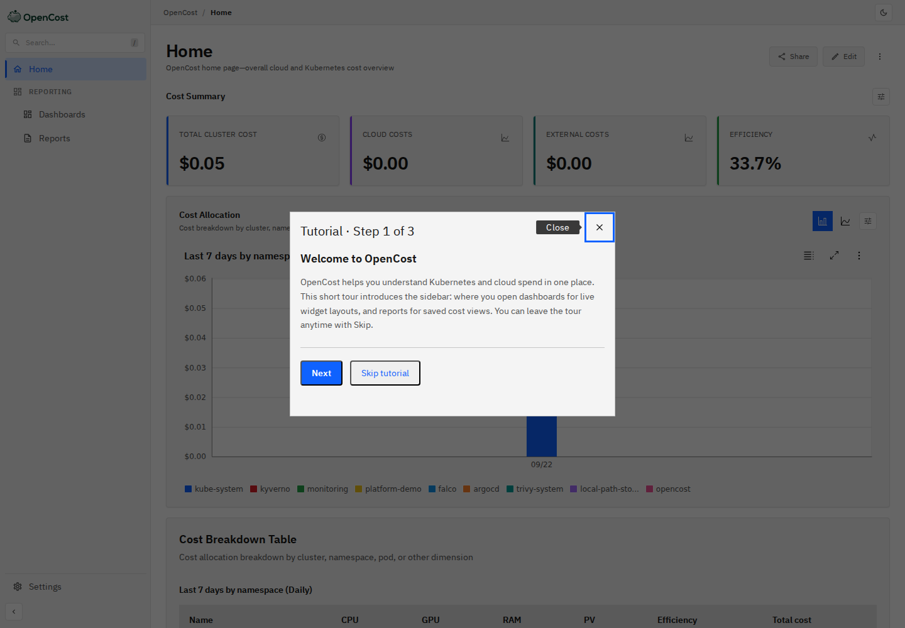

# Local Runtime Evidence

The AWS activation path remains intentionally unexecuted, but the platform now also has **real runtime evidence** from a disposable local Kubernetes environment. This closes the gap between static CI and cloud provisioning without implying that an EKS account exists.

## Runtime environment

Evidence below was captured on **22 September 2026** from:

- `kind` cluster `platform-local`;
- Kubernetes **v1.36.4**;
- Argo CD reconciliation;
- Kyverno admission enforcement;
- kube-prometheus-stack / Prometheus;
- Trivy Operator;
- Falco modern eBPF;
- VPA in recommendation-only mode;
- OpenCost connected to the in-cluster Prometheus service.

The sanitized command transcript is stored at [`docs/evidence/local-runtime-2026-09-22.txt`](evidence/local-runtime-2026-09-22.txt).

## GitOps reconciliation

The following applications were **Healthy / Synced** during the capture:

| Argo application | Runtime state |
| --- | --- |
| `platform-demo` | Healthy / Synced |
| `platform-security-policies` | Healthy / Synced |
| `vertical-pod-autoscaler` | Healthy / Synced |
| `opencost` | Healthy / Synced |
| `cost-controls` | Healthy / Synced |
| `cost-monitoring-resources` | Healthy / Synced |

This is evidence from the local `kind` runtime. It is not evidence of Argo running in EKS.

## Signed-image admission

Two server-side admission requests were executed against the `platform-demo` namespace:

1. the immutable project image `ghcr.io/fadyy2k/platform-demo@sha256:5fc1...89db` was **admitted**;
2. `nginx:1.27` was **denied** by `validate-platform-demo-images` because it is neither the project-owned image nor digest-pinned.

The signed project image is also checked by the Kyverno `ImageValidatingPolicy` against the GitHub Actions OIDC signing identity.

## Prometheus and SLOs

Both demo replicas were discovered and healthy in Prometheus:

```text
platform-demo scrape targets up=2/2
rule-group=platform-demo.slo.alerts rules=3
rule-group=platform-demo.slo.recording rules=3
```


## Trivy runtime report

Trivy Operator produced a report for the immutable Phase-4 digest:

```text
critical=0 high=0 medium=0 low=0
sha256:5fc1d1e30a9a7ec08830000b794dd5fefdec2026782224f9bb6bf87de89889db
```

This is an in-cluster Trivy Operator report, distinct from the build-time Trivy gate in GitHub Actions.

## Falco runtime detection

A temporary Alpine pod was created in the default namespace and used for a **benign runtime-security probe**. Reading `/etc/shadow` inside that isolated test container triggered Falco's:

```text
Read sensitive file untrusted
```

Falco associated the event with `falco-runtime-probe` and the temporary pod was deleted immediately after the test. This proves the syscall runtime sensor is producing Kubernetes-attributed detections in the local cluster.

## Recovery game day

The existing dry-run-first game-day helper was executed with `EXECUTE=1` against the local dev cluster for the `pod-failure` scenario.

Observed result:

```text
one platform-demo pod deleted
Deployment recovered to 2/2 available
Argo application: Healthy / Synced
```

The exercise did not touch AWS and did not execute against production.

## VPA recommendation-only evidence

The VPA remains non-mutating:

```text
updateMode=Off
current requests: 50m CPU / 64Mi memory
observed recommendation: 25m CPU / 250Mi memory
```

The memory recommendation is higher than the current request while the CPU recommendation is lower. The repository therefore records the recommendation as **evidence to review**, not as an automatic resize.

## OpenCost local allocation

OpenCost successfully queried the in-cluster Prometheus instance and returned real allocation data for `platform-demo`. During capture the allocation showed a very low CPU utilization relative to requests and a non-zero local model cost.



!!! warning "Pricing boundary"
    The `kind` cluster has no AWS cloud-provider pricing identity. OpenCost's local/default model is useful for proving allocation plumbing and efficiency calculations, but the values are **not an AWS bill and must not be represented as cloud spend**.

## Reproduce the read-only checks

With the local stack already running:

```bash
./scripts/local-runtime-verify.sh
```

The helper refuses non-`kind` contexts by default. It performs read operations plus server-side dry-run admission requests; it does not run the destructive game day.

## Still AWS-specific

The local runtime does **not** prove:

- GitHub OIDC assuming an AWS IAM role;
- S3/KMS Terraform remote state;
- an EKS control plane or managed node group;
- AWS load balancer/NAT/network behavior;
- AWS-specific OpenCost pricing;
- multi-region failover.

Those remain explicitly separated in the [Live Activation Runbook](LIVE_ACTIVATION.md).
