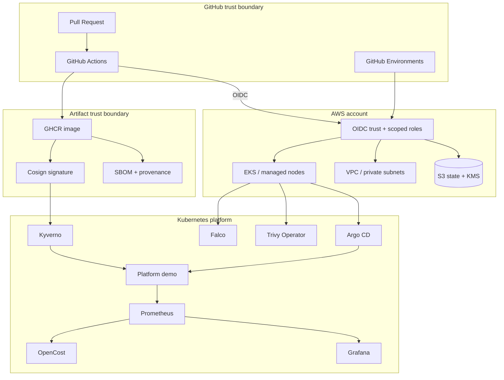

# Platform Architecture

## Trust boundaries

## Design rules

### 1. Cloud credentials are ephemeral

CI does not require stored AWS access keys. GitHub OIDC subjects and environment boundaries define who can assume plan/apply roles.

### 2. State is a security asset

Terraform state is versioned, KMS-encrypted and public access is blocked. State recovery is documented separately from infrastructure recovery.

### 3. Desired state and runtime evidence are different

Git is the desired-state source. Prometheus, policy reports, vulnerability reports and runtime detection provide operational evidence after reconciliation.

### 4. Artifact identity is immutable

Workloads consume images by digest. Build provenance, SBOM, vulnerability scan and Cosign identity are attached to the artifact before promotion.

### 5. Failure is designed, not improvised

SLO alerts map to runbooks. Game-day tools are dry-run by default. Backup/restore verification is explicit and separate from merely configuring backup tooling.
