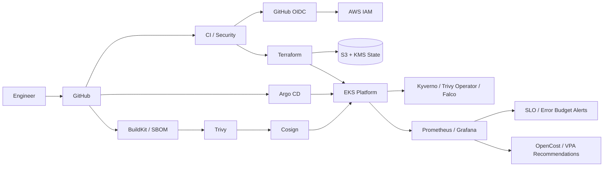

# AWS EKS Platform Engineering Reference

**A production-style public reference for building, securing and operating an AWS EKS platform.**

This project is organized around trust boundaries and operational evidence rather than around a single deployment script. It covers infrastructure, identity, GitOps, software supply-chain security, admission/runtime policy, observability, SLOs, cost controls and disaster-recovery patterns.

[:material-github: Repository](https://github.com/fadyy2k/platform-engineering-eks-gitops){ .md-button .md-button--primary }
[:material-tag: Releases](https://github.com/fadyy2k/platform-engineering-eks-gitops/releases){ .md-button }

### Engineering layers

`Identity` → `State` → `IaC` → `Supply chain` → `GitOps` → `Policy` → `Runtime` → `SLOs` → `Cost` → `DR`

## Architecture at a glance

## What this repository proves

-   :material-identifier:{ .lg .middle } **Identity & state**

    ---

    GitHub Actions OIDC, separate plan/apply roles, KMS-encrypted versioned state, native S3 locking and explicit environment state boundaries.

-   :material-shield-check:{ .lg .middle } **Supply-chain & runtime security**

    ---

    Provenance, SBOM, Trivy, Cosign keyless signing, Kyverno admission policy, Trivy Operator and Falco runtime-detection scaffolding.

-   :material-heart-pulse:{ .lg .middle } **Reliability engineering**

    ---

    99.5% availability SLO, burn-rate alerts, ServiceMonitor, HPA/PDB, runbooks, controlled failure injection and recovery-test harnesses.

-   :material-currency-usd:{ .lg .middle } **Operational economics**

    ---

    OpenCost visibility, budget run-rate alerting, VPA recommendation-only right-sizing evidence and active/passive DR architecture.

## Evidence boundary

!!! info "Static evidence vs live evidence"
    CI proves syntax, policy tests, rule behavior, image signing, manifest validity and reproducible configuration. It does **not** claim that AWS resources, paging integrations, backup storage or multi-region recovery are live when they have not been explicitly provisioned and exercised.

## Recommended reading path

1. [Architecture](architecture.md)
2. [Bootstrap and OIDC](BOOTSTRAP.md)
3. [IAM model](IAM.md)
4. [Supply chain](SUPPLY_CHAIN.md)
5. [Runtime security](RUNTIME_SECURITY.md)
6. [Reliability and SLOs](RELIABILITY.md)
7. [Cost operations](COST_OPERATIONS.md)
8. [Roadmap](ROADMAP.md)
